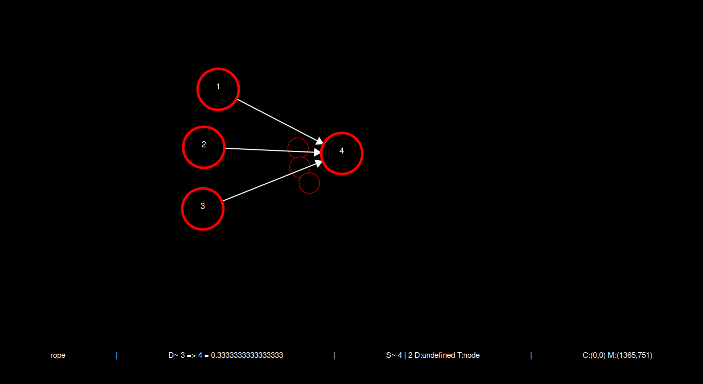

<h1> Neuralyze </h1>
Neuralyze helps to visualize and create neural networks  

<h2>Modes:<h2>
<ul>
<li><b>command</b>: to excute commands like add/delete node||dendrite </li>
<li><b>Edit</b>: click node/dendrite to edit them </li>
<li><b>rope</b>: Move node in the space</li>
<li><b>move</b>: Move within the space</li>
<li>dblClick on node: <b>edit_node</b>: edit node </b>
<li>dblClick on denderite: <b>edit_dendrite</b>: edit dendrite </b>
</ul> 
<h2>Commands:<h2>
<ul>
<li><b>Esc</b>: Switch to command mode</li>
<li><b>f</b>: Switch to move mode</li>
<li><b>e</b>: Switch to Edit mode</li>
<li><b>r</b>: Switch to rope mode</li>
<li><b>a</b>: Add node</li>
<li><b>t</b>: connect two nodes with a dendrite</li>
<li><b>d</b>: delete selected node and all it's dendrites</li>
<li><b>p</b>: print states</li>
<li><b>g</b>: generate neural network </li>
<li><b>:gen {path/filename.ddb}</b> to generate neural network and store it in demon database format(.ddb)
<li><b>:save {path/filename.nz}</b>: to store the nz file </li>
<li><b>:load {path/filename.nz}</b>: to load the nz file </li>
<li><b>:dp {path}</b>: To set a default path</li>
</ul>
